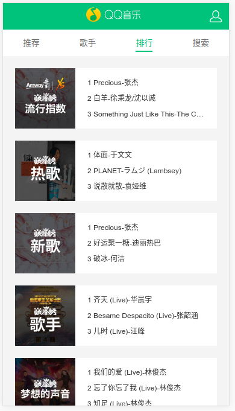
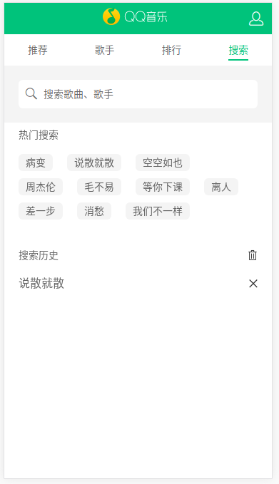
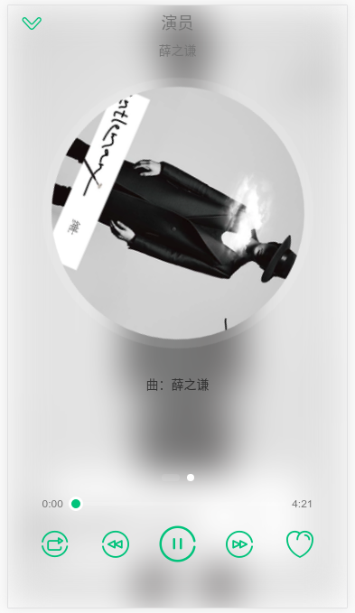
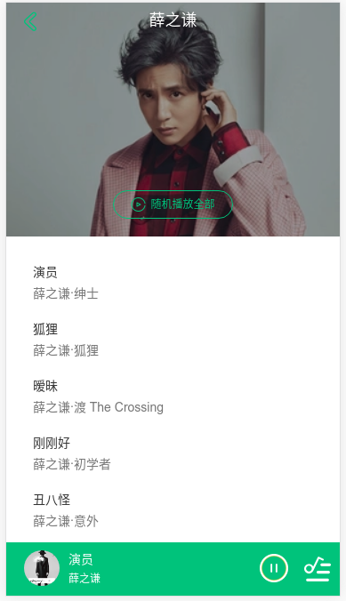

# vue-music

基于Vue2.x的音乐WebApp

> A Vue.js project

## 技术栈

- Vue2.4
- Vuex
- vue-router
- scss
- axios
- jsonp
- better-scroll

## Build Setup

``` bash
# install dependencies
npm install

# serve with hot reload at localhost:8080
npm run dev

# build for production with minification
npm run build

# build for production and view the bundle analyzer report
npm run build --report
```

For a detailed explanation on how things work, check out the [guide](http://vuejs-templates.github.io/webpack/) and [docs for vue-loader](http://vuejs.github.io/vue-loader).


## 截图

>推荐


>歌手


>排行



>搜索



>播放器



>歌手详情



